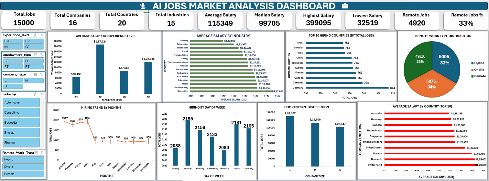
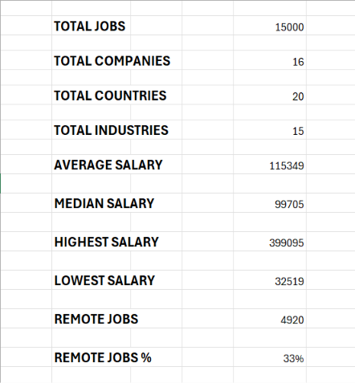
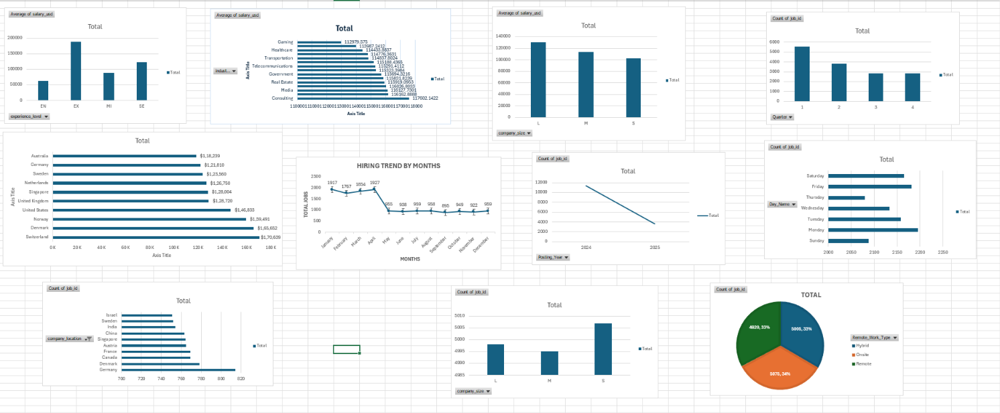

# AI Jobs Data Analysis

## 📌 Project Overview

This project analyzes an AI Jobs dataset using Microsoft Excel to identify important trends, patterns, and insights related to AI job opportunities.

The project includes data cleaning, exploratory analysis, pivot tables, charts, an executive summary, and an interactive dashboard.

## 🛠️ Tools & Technologies

- Microsoft Excel
- Data Cleaning
- Pivot Tables
- Excel Charts
- Data Analysis
- Dashboard

## 📊 Dataset

The project uses an AI Jobs dataset containing information related to AI job opportunities.

The workbook contains the following major sections:

- Raw Data
- Cleaned Data
- Executive Summary
- Pivot Table Analysis
- Charts
- Dashboard

## 🔄 Project Workflow

1. Raw data preparation
2. Data cleaning
3. Data analysis using Pivot Tables
4. Visualization using Excel Charts
5. Executive Summary preparation
6. Dashboard creation

## 📈 Analysis Performed

The project covers the following analysis areas:

- Data cleaning and preparation
- Job market analysis
- Salary analysis
- Job category analysis
- Location-based analysis
- Experience-level analysis
- Pivot table analysis
- Data visualization
- Executive summary
- Dashboard reporting

## 📊 Excel Workbook Structure

| Sheet | Description |
|---|---|
| Raw_data | Original dataset |
| Cleaned_data | Prepared and cleaned dataset |
| Executive Summary | Summary of important findings |
| Pivot Table | Detailed analytical calculations |
| Charts | Visual representation of analysis |
| Dashboard | Final dashboard for insights |

## 🎯 Objective

The main objective of this project is to transform raw AI job data into meaningful insights using Microsoft Excel and present the findings through an interactive and easy-to-understand dashboard.

## 📸 Project Preview

### Dashboard



### Executive Summary



### Charts



## 📁 Project Structure

```text
AI-Jobs-Data-Analysis/
│
├── README.md
├── AI_Jobs_Data_Analysis.xlsx
│
├── Documentation/
│   └── Project_Overview.md
│
└── Screenshots/
    ├── dashboard.png
    ├── executive-summary.png
    └── charts.png

## 🔍 Key Insights

Based on the analysis performed in Microsoft Excel:

- The dataset contains 15,000 AI-related job records.
- The dataset covers job titles, salaries, experience levels, employment types, company locations, education requirements, industries, remote-work patterns, and other job attributes.
- Salary analysis was performed across experience levels, company sizes, and industries.
- Remote, hybrid, and onsite job patterns were analyzed using the remote-work information.
- Year- and month-based analysis was performed to understand job-posting trends.
- Pivot Tables were used to summarize salary, job counts, and other important dimensions.
- The final dashboard presents the analyzed information in a visual and easy-to-understand format.

💡 Key Skills Demonstrated

-Data Cleaning
-Data Analysis
-Excel Pivot Tables
-Data Visualization
-Dashboard Development
-Business Reporting
-Analytical Thinking
-Insight Generation

📌 Deliverables

-Cleaned and structured dataset
-Pivot table analysis
-Data visualizations
-Executive summary
-Interactive dashboard
-Professional project documentation  

## 🚀 How to Use

1. Download `AI_Jobs_Data_Analysis.xlsx` from this repository.
2. Open the workbook in Microsoft Excel.
3. Review the `Raw_data` and `Cleaned_data` sheets.
4. Explore the Pivot Tables and Charts.
5. Review the Executive Summary.
6. Explore the final Dashboard.

## 📌 Project Highlights

This project demonstrates an end-to-end Excel data analysis workflow, from raw data preparation and cleaning to analytical reporting and dashboard visualization.

It showcases practical skills in data cleaning, exploratory analysis, Pivot Tables, visualization, and business-oriented reporting using Microsoft Excel.

## 📂 Repository Contents

- **AI_Jobs_Data_Analysis.xlsx** — Complete Excel analysis workbook
- **[EDA Report](Documentation/EDA_Report.md)** — Detailed exploratory data analysis
- **Documentation/** — Project documentation
- **Screenshots/** — Dashboard and analysis previews
- **README.md** — Project overview and documentation   
